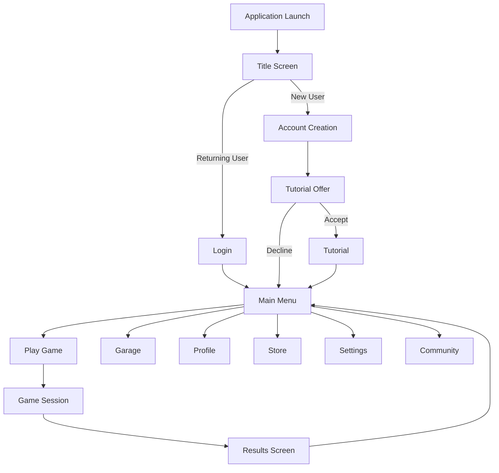

# Tank Commander: Application Flow

## User Journey Overview

## Detailed Screen Flows

### 1. Application Launch & Authentication

#### Initial Launch Sequence
1. **Splash Screen**
   - Developer logo (3 seconds)
   - Publisher logo (3 seconds)
   - Engine credits (2 seconds)

2. **Title Screen**
   - Dynamic background with tank models
   - Game logo animation
   - Press Start/Enter prompt
   - Version number display
   - Legal information (small text)

3. **Authentication Flow**
   - **New User Path**:
     - Account creation form
     - Email verification
     - Terms acceptance
     - Initial profile setup (username, avatar selection)
   
   - **Returning User Path**:
     - Credential input
     - "Remember Me" option
     - Password recovery option
     - Platform authentication alternatives (Steam, Epic, etc.)

4. **First-Time Experience**
   - Tutorial offer for new accounts
   - Introductory cinematic for context
   - Basic controls explanation
   - Reward for tutorial completion
   - Option to skip (with confirmation)

### 2. Main Menu Hub

#### Core Navigation
1. **Main Menu Layout**
   - Central hub design with tank garage background
   - Animated elements showing game activity
   - News ticker for updates and events
   - Notification indicators for new content
   - Quick-access toolbar for frequently used features

2. **Primary Navigation Options**
   - **Play**: Game mode selection
   - **Garage**: Tank customization and loadout
   - **Profile**: Player statistics and achievements
   - **Store**: In-game purchases and unlocks
   - **Settings**: Game configuration options
   - **Community**: Social features and leaderboards
   - **Exit**: Quit game with confirmation

3. **Secondary UI Elements**
   - Player level and XP bar
   - Currency displays
   - Friend activity indicators
   - Special event countdown timers
   - Daily challenge status

### 3. Game Mode Selection

#### Play Menu Hierarchy
1. **Mode Categories**
   - **Campaign**: Story-driven single-player experience
     - Mission select with progress tracking
     - Difficulty selection
     - Chapter navigation
     - Mission briefing screen
     - Loadout confirmation before launch
   
   - **Arcade**: Quick-play standalone experiences
     - Mode selection (Survival, Time Trial, etc.)
     - Difficulty/parameter customization
     - Map selection with preview
     - Loadout selection
     - Instant launch option
   
   - **Multiplayer**: Online competitive gameplay
     - Mode selection (Deathmatch, CTF, etc.)
     - Quick match option
     - Server browser (with filters)
     - Party management interface
     - Match preferences settings
   
   - **Co-op**: Collaborative multiplayer
     - Mission/mode selection
     - Public/private game options
     - Friend invite system
     - Voice chat setup
     - Role selection interface
   
   - **Custom Games**: User-defined experiences
     - Template selection
     - Rule customization
     - Map editor access
     - Save/load configuration
     - Share options for custom setups

2. **Matchmaking Process** (Multiplayer)
   - Preference selection screen
   - Skill-based matchmaking display
   - Queue status with estimated wait time
   - Background activities during wait
   - Cancellation option
   - Match found confirmation

### 4. Gameplay Loop

#### In-Game Flow
1. **Loading Sequence**
   - Map loading screen with game tips
   - Progress indicator
   - Contextual information about selected mode
   - Optional mini-game during longer loads
   - Controller reminder icons

2. **Pre-Game Phase**
   - Team/opponent display
   - Map overview with strategic information
   - Loadout final confirmation (where applicable)
   - Countdown timer to start
   - Quick chat/communication options

3. **Active Gameplay**
   - Core gameplay loop with HUD elements
   - Objective updates and notifications
   - Score/progress tracking
   - Dynamic events and announcements
   - Contextual hint system for new players

4. **Pause Menu**
   - Resume option
   - Control reminders
   - Settings quick-access
   - Objective reminder
   - Quit option (with consequences explained)

5. **End of Match**
   - Victory/defeat screen with animation
   - Performance statistics summary
   - XP and reward calculation (animated)
   - Highlight moments replay
   - Commendation/voting system

6. **Post-Game Analysis**
   - Detailed performance statistics
   - Progression updates (unlocks, level-ups)
   - Challenge completion tracking
   - Social sharing options
   - "Next Match" and "Return to Menu" options

### 5. Tank Customization

#### Garage Interface
1. **Tank Selection**
   - Visual carousel of owned vehicles
   - Tank classification indicators
   - Stat comparison functionality
   - Lock icons on unavailable tanks
   - Favorites marking system
   - "New" indicators for recently acquired

2. **Customization Categories**
   - **Performance**: Engine, tracks, transmission
     - Part selection interface
     - Stat impact visualization
     - Cost and level requirements
     - Installation animation
     - Before/after comparison
   
   - **Weaponry**: Main gun, secondary weapons
     - Weapon selection menu
     - Ammunition type options
     - Damage/rate of fire visualization
     - Test-fire option in garage
     - Compatibility indicators
   
   - **Defense**: Armor, countermeasures
     - Armor placement interface
     - Protection visualization
     - Weight/speed impact indicators
     - Active defense selection
     - Resistance type indicators
   
   - **Appearance**: Paint, decals, accessories
     - Color selection with preview
     - Pattern application interface
     - Decal placement with scaling/rotation
     - Accessory mounting points
     - Preset saving/loading

3. **Loadout Management**
   - Saved configuration slots
   - Quick-swap loadout interface
   - Situation-specific recommendations
   - Cost optimization suggestions
   - Share loadout functionality

### 6. Player Progression

#### Profile System
1. **Career Overview**
   - Player level and rank display
   - XP progress visualization
   - Career statistics summary
   - Achievement showcase
   - Playtime tracking by mode

2. **Achievement System**
   - Category-based achievement browser
   - Progress tracking for incomplete achievements
   - Reward information
   - Recently completed highlights
   - Rarity indicators

3. **Battle History**
   - Recent matches list
   - Performance metrics over time
   - Replay access
   - Heatmap of battle performance
   - Favorite moments gallery

4. **Ranking System**
   - Competitive rank display
   - Division/league information
   - Rank progression history
   - Seasonal rewards tracking
   - Leaderboard position

### 7. In-Game Store

#### Purchase Flow
1. **Store Navigation**
   - **Featured Items**: Rotating highlighted content
   - **Tanks**: New vehicle purchases
   - **Parts**: Performance upgrades
   - **Weapons**: Combat options
   - **Cosmetics**: Visual customizations
   - **Bundles**: Discounted packages
   - **Special Offers**: Limited-time deals

2. **Item Details**
   - Detailed item view with 3D preview
   - Stat comparison with owned items
   - Price and currency information
   - Sale/discount indicators
   - Bundle contents breakdown
   - Related item suggestions

3. **Purchase Process**
   - Item selection
   - Currency selection (in-game vs. premium)
   - Confirmation dialog
   - Purchase animation
   - Receipt and inventory update
   - "Equip Now" option

4. **Currency Management**
   - Current balance display
   - Currency purchase options
   - Transaction history
   - Subscription status (if applicable)
   - Gift card redemption

### 8. Settings & Configuration

#### Options Menu
1. **Settings Categories**
   - **Gameplay**: Difficulty, assistance options, etc.
   - **Controls**: Input mapping, sensitivity, etc.
   - **Video**: Resolution, quality, effects, etc.
   - **Audio**: Volume levels, mix options, etc.
   - **User Interface**: HUD options, notifications, etc.
   - **Accessibility**: Colorblind mode, text size, etc.
   - **Account**: Privacy, linking, data management

2. **Control Configuration**
   - Button mapping visualization
   - Control scheme presets
   - Custom binding interface
   - Controller/keyboard switching
   - Advanced options (deadzones, curves)

3. **Profile Management**
   - Multiple profile support
   - Cloud save options
   - Data export/import
   - Account linking
   - Privacy settings

### 9. Community Features

#### Social Interaction
1. **Friends System**
   - Friend list with online status
   - Add friend interface
   - Recent players list
   - Block/mute options
   - Friend activity feed

2. **Clan/Group System**
   - Clan browsing and creation
   - Member management
   - Clan statistics and achievements
   - Internal communication tools
   - Recruitment options

3. **Leaderboards**
   - Global rankings
   - Friend comparison
   - Category filtering
   - Historical performance
   - Reward thresholds

4. **Community Content**
   - User-created maps browser
   - Rating and review system
   - Creation tools access
   - Featured community content
   - Reporting functionality

### 10. Supplementary Flows

#### Additional Systems
1. **Tutorial System**
   - Tiered tutorial progression
   - Interactive learning elements
   - Skill-check validation
   - Reward structure
   - Quick reference guide

2. **Notification Center**
   - Aggregated alerts and notices
   - Category filtering
   - Action links from notifications
   - Clear/dismiss functionality
   - Notification settings

3. **Help & Support**
   - Searchable knowledge base
   - Context-sensitive help
   - Video tutorials
   - Support ticket creation
   - Community forums link

4. **Event System**
   - Calendar view of upcoming events
   - Event details and rewards
   - Registration/participation tracking
   - Event history and results
   - Reminder setting

## Mobile Companion App Integration

### Companion Features
1. **Account Synchronization**
   - Cross-platform login
   - Profile viewing
   - Stats tracking
   - Notification management

2. **Social Features**
   - Friend management
   - Chat functionality
   - Clan communication
   - Activity feed

3. **Game Planning**
   - Loadout customization
   - Progression planning
   - Purchase queue
   - Remote inventory management

4. **Community Engagement**
   - Forums access
   - Content browser
   - Vote on community features
   - Event participation tracking

## Backend Service Flows

### Data Management
1. **User Authentication Process**
   - Credential validation
   - Session management
   - Token refresh mechanism
   - Multi-device handling
   - Security monitoring

2. **Game State Synchronization**
   - Save data management
   - Cross-device progress sync
   - Conflict resolution
   - Backup and recovery options

3. **Matchmaking Pipeline**
   - Player skill evaluation
   - Match quality determination
   - Team balancing algorithm
   - Server selection process
   - Backfill handling for dropouts

4. **Content Delivery**
   - Update detection and notification
   - Differential patching
   - Background downloading
   - Installation verification
   - Rollback capability

## Exceptional Flows

### Error Handling
1. **Connection Issues**
   - Offline mode activation
   - Reconnection attempts
   - Progress protection measures
   - Sync upon reconnection
   - User notification system

2. **Account Recovery**
   - Password reset flow
   - Account verification steps
   - Security questions/2FA handling
   - Support escalation path
   - Account restoration process

3. **Purchase Problems**
   - Transaction verification
   - Retry mechanisms
   - Receipt validation
   - Support request generation
   - Compensation process

4. **Game Crashes**
   - Crash data collection
   - Auto-recovery attempt
   - Session state preservation
   - Report submission option
   - Troubleshooting guidance 